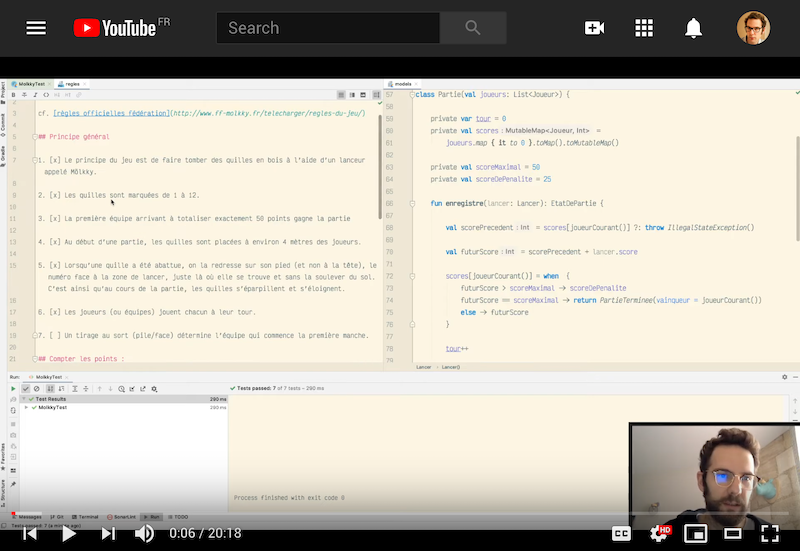

---

title: "🖥"
author: "Julien Terrier"

---

## A few personal experimentations

# [Dojo Mölkky](https://github.com/legzo/dojo-molkky)

*#kotlin #dojo #youtube*

The rules of Mölkky implemented in Kotlin - this projects was built during [a series of 7 youtube videos](https://www.youtube.com/playlist?list=PLX3k_dCSBA49TfOPFwg7iqqxFvyTsP-H-) I made during the Covid-19 lockdown for the members of my team. The goal was to discover a few of the features of the Kotlin language through a fun dojo.

