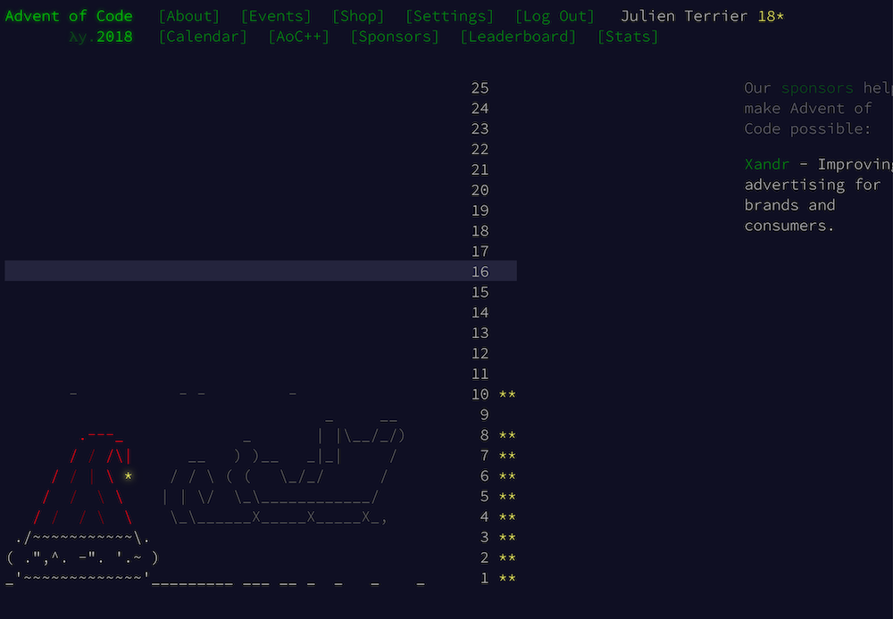
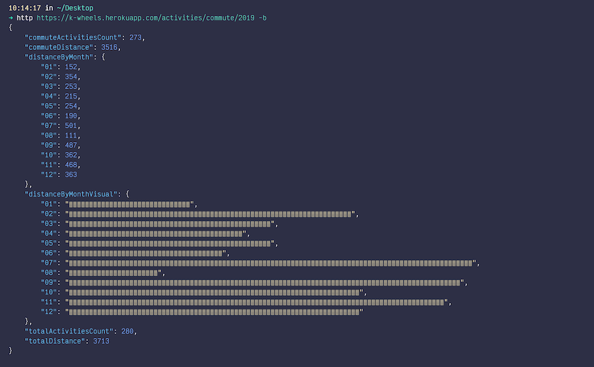

---

title: "🖥"
author: "Julien Terrier"

---

# A few personal experimentations

## [Fip Recorder](https://github.com/legzo/fip-recorder)

*#kotlin #fly.io #htmx #http4k*

I enjoy listening to [Fip Radio](https://www.radiofrance.fr/fip), it is almost 100% music and very eclectic. I can't count the bands that I discovered thanks to this radio. So I made a wep application that connects to the Fip API in order to fetch all the songs aired during a week and generates a list of the top played songs. You can then export this list as a Spotify playlist ! I learned how to use [fly.io](https://fly.io) for a kotlin http4k backend and used a bit of [htmx](https://htmx.org) as I was curious about all the hype.

 

## [Touch - Pause - Engage](https://github.com/legzo/touch-pause-engage)

*#kotlin #observableplot #dataviz*

In the 2021-22 season, the french rugby union championship was uncertain until the last minutes of play. I was curious to see how the rankings evolved minute by minute during the last games of the season. So I got the data from a website, wrangled it in kotlin and exported it as json, to be plotted with [Observable Plot](https://observablehq.com/@observablehq/plot).

 

## [Dojo Mölkky](https://github.com/legzo/dojo-molkky)

*#kotlin #dojo #youtube*

The rules of Mölkky implemented in Kotlin - this projects was built during [a series of 7 youtube videos](https://www.youtube.com/playlist?list=PLX3k_dCSBA49TfOPFwg7iqqxFvyTsP-H-) I made during the Covid-19 lockdown for the members of my team. The goal was to discover a few of the features of the Kotlin language through a fun dojo.

 

## [Advent of Code](https://github.com/legzo/advent-of-code-2018)

*#kotlin*

I really enjoy the challenges from the yearly Advent of Code. I solved almost a half of the 2018 puzzles as well as some from 2019. It was an opportunity for me to try to write Kotlin code as idiomatic as possible. I also used some of the challenges for coding dojos with my team.

 

## [k-wheels](https://github.com/legzo/k-wheels)

*#kotlin #ktor #svelte #heroku #vercel*

I love cycling and I record my routes with Strava. But with a free account the analysis possibilities are a bit restricted on Strava. So I built an API that calls Strava API, and uses a local nosql database to store data and run analysis on it. It is deployed on Heroku and [you can for example see the kilometers I made each months of 2019](https://k-wheels.herokuapp.com/activities/commute/2019). In order to respect quotas and to be efficient while fetching data from Strava, I used coroutines to parallelize back-end API calls.

 I built a frontend a few months later using Svelte as I was eager to learn more about the framework. I hosted it on Vercel which was also a new thing for me.
 
 

 

## [processing-stuff](https://github.com/legzo/processing-stuff)

*#processing #typescript*

I really enjoy [Daniel Shiffman's youtube videos](https://www.youtube.com/c/TheCodingTrain). I completed his MOOC ["The Nature of Code" on Kadenze](https://www.kadenze.com/courses/the-nature-of-code-ii/info). And here are a few experiments I made using p5.js (processing ported to js) and typescript instead of js.

 

## [Turfu](https://github.com/legzo/turfu-web)

*#kotlin #http4k #vanillajs*

A friends of my wife's grandmother (!) asked me if I could implement a way to calculate a few rules to determine (according to her...) the best way to win at horse race betting. It was an opportunity to apply functional programing concepts and to discover the Http4k library. I also used this topic to build an internal series of dojos at work around immutability and lists manipulation.

 

## Older stuff

### [Vroum](https://github.com/legzo/vroum)

*#nodejs #express* 

API-fication of the french second-hand vehicle website : La Centrale (via crawling). 

### [Jamming](https://github.com/legzo/jamming)

*#java #elasticsearch #d3js #heroku*

Analysis and graphing of the road traffic on the Bordeaux rocade. Crawling of the BisonFuté website, data storing in elasticsearch, graphing with D3js.
